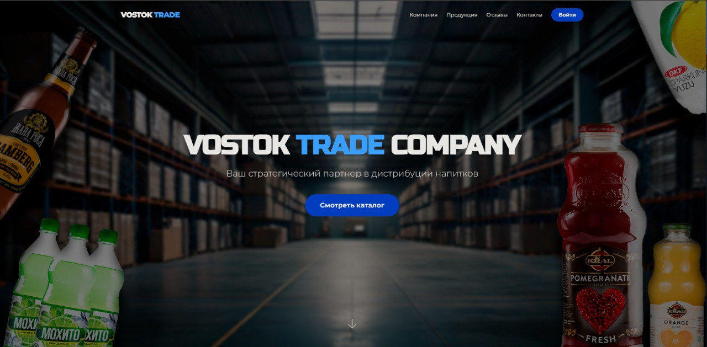

# 🚀 VOSTOK TRADE COMPANY


<div align="center">
  
  <br>
  <h3>Современная B2B платформа для дистрибуции напитков</h3>
  
  <a href="https://vostok-trade.onrender.com">
    
  </a>
</div>

---

## 📖 О проекте

**VOSTOK TRADE** — это fullstack веб-приложение для оптовой торговой компании. Проект объединяет в себе лендинг, каталог продукции и панель администрирования. Платформа позволяет клиентам ознакомиться с ассортиментом и запросить прайс-лист, а администраторам — управлять товарами через загрузку Excel-файлов.

Это вторая версия проекта. Он был переписан с классической связки React+Express на **Next.js 15 (App Router)** для улучшения SEO, производительности и удобства деплоя.

---

## 🛠️ Стек технологий

Проект построен на современном стеке технологий, обеспечивающем высокую производительность и масштабируемость.

### Core & Frontend


### Backend & Database


### Utilities & Tools


---

## ✨ Ключевые возможности

* **⚡ Server Side Rendering (SSR):** Быстрая загрузка и отличная SEO-оптимизация благодаря Next.js.
* **🔐 Авторизация:** Система регистрации и входа с использованием JWT (Access Token).
* **🛒 Динамический каталог:** Товары подгружаются из базы данных MongoDB.
* **📩 Email-рассылка:** Автоматическая отправка прайс-листов клиентам на почту (Nodemailer).
* **👑 Админ-панель:**
    * Просмотр истории запросов клиентов.
    * Массовая загрузка/обновление товаров через **Excel (.xlsx)**.
* **🎨 UI/UX:** Адаптивный дизайн, темная тема, плавные анимации (AOS), параллакс-эффекты.

---

## 🚀 Запуск проекта локально

Следуйте инструкции, чтобы развернуть проект на своем компьютере.

### 1. Клонирование репозитория
```bash
git clone [https://github.com/Doomsday058/vostok-trade.git](https://github.com/ВАШ_НИКНЕЙМ/vostok-trade.git)
cd vostok-trade
```

### 2. Установка зависимостей

 ```bash
npm install
# или
yarn install
```

### 3. Настройка окружения

 ```bash
# База данных (MongoDB Atlas)
MONGO_URI=mongodb+srv://<username>:<password>@cluster.mongodb.net/vostok-trade

JWT_SECRET=super_secret_key_change_me

# Настройки почты (Gmail SMTP)
SMTP_HOST=smtp.gmail.com
SMTP_PORT=465
SMTP_USER=your_email@gmail.com
SMTP_PASS=your_app_password
```

### 4. Запуск в режиме разработки

 ```bash
npm run dev
```
